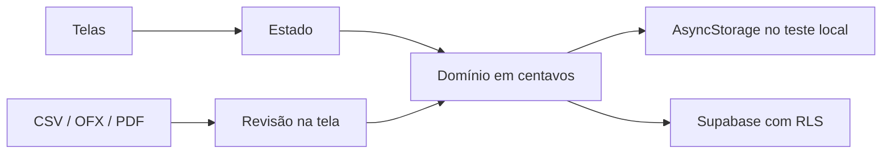

<p align="center">
  
</p>

<h1 align="center">Cifrio</h1>

<p align="center">
  <strong>Seu dinheiro, com clareza.</strong><br />
  Contas, gastos e o que ainda está por vir — num só lugar, em centavos, sem número inventado.
</p>

<p align="center">
  
  
  
  
</p>

Cifrio é o piloto de finanças pessoais: uma mesa clara para registrar o que entrou, o que saiu e o que o cartão ainda vai cobrar. Nada de saldo “consultado no banco” disfarçado de lançamento manual. Nada de dashboard preenchido com dinheiro fictício. Você coloca o dado. O app mostra o mês.

Identidade de trabalho: azul profundo, verde de acento, Manrope. Marca e domínio ainda não estão validados.

---

## O que ele faz

| | |
| --- | --- |
| **Contas** | Saldo inicial e saldo registrado até hoje. |
| **Movimentações** | Receita, despesa, Pix manual, transferência entre contas. Editar e excluir. |
| **Cartões** | Nome, compras parceladas, faturas projetadas, pagamento parcial ou integral. |
| **Mês** | Relatório por categoria. Parcela entra. Transferência e pagamento de fatura não viram gasto duas vezes. |
| **Importar** | CSV, OFX e PDF de texto, com revisão antes de gravar. Reimportar não duplica. |
| **Exportar** | JSON dos registros, valores em centavos. |
| **Conta** | Login e cadastro no Supabase, Google via OAuth PKCE, perfil com nome e foto. |

Fechamento manual: compra no dia do fechamento cai na competência seguinte. Dias de fechamento e vencimento vão de 1 a 28. Fatura projetada é estimativa, não o PDF do banco. Limite cadastrado não é limite disponível.

PDF de foto, com senha ou de layout desconhecido não entra. Fatura com mais de um cartão só importa a parte de quem está no perfil.

---

## Como rodar

Node.js 24, npm e um navegador. Dependências e lockfile estão fixados.

```powershell
npm.cmd ci
npm.cmd run web
```

Abra a URL do Expo e escolha **Abrir teste local**. A sessão nasce vazia: cadastre contas e cartões. Os dados da prévia ficam no aparelho, via AsyncStorage. Esse modo não é cofre para extrato real.

| Comando | Para quê |
| --- | --- |
| `npm.cmd run web` | Prévia no navegador. |
| `npm.cmd run dev` | Servidor Expo, inclusive celular. |
| `npm.cmd run android` / `ios` | Atalhos do mesmo servidor. Não geram APK nem IPA. |
| `npm.cmd run check` | Typecheck e testes. |
| `npm.cmd run test:browser` | Jornada no Chromium. Antes: `npx.cmd playwright install chromium`. |
| `npm.cmd run build` | Export web. |

Validação nativa pede development build compatível com o SDK 57. Compilar iOS localmente exige macOS e Xcode. No Windows o código anda; o binário nativo, quando chegar, sai de um serviço de nuvem.

---

## Importar sem se arrepender

O arquivo é lido no dispositivo. O original não sobe. No modo online, só o lançamento que você confirmar vai para o Supabase.

**CSV** — UTF-8, até 2 MB e 500 linhas. Você escolhe as colunas. Data `DD/MM/AAAA` ou `AAAA-MM-DD`. Positivo é receita, negativo é despesa. Exemplo sintético: [`samples/extrato-teste.csv`](samples/extrato-teste.csv). A reimportação é idempotente por arquivo, conta e linha.

**OFX** — blocos `STMTTRN` com `DTPOSTED`, `TRNAMT`, `MEMO`/`NAME` e `FITID` opcional. O `FITID` evita repetir o mesmo lançamento na mesma conta. Não é uma promessa de ler todo banco do país. Períodos sobrepostos pedem olho humano. Data e valor iguais, sozinhos, não são descartados.

**PDF** — texto selecionável, até 500 movimentações. Data e valor na mesma linha; saldo, subtotal e total ficam de fora. Crédito e débito respeitam o sinal, o sufixo `C`/`D` e, em fatura de cartão, o sentido da compra. Fatura com vários portadores usa o nome do perfil para ficar só com a sua parte.

A extração não adivinha Pix. Categoria inicial: Outros. Classifique depois.

Extratos e faturas reais estão no `.gitignore` (`*.pdf`). O teste que lê uma fatura de exemplo só roda se o arquivo estiver na sua máquina.

---

## Conta online

Copie [`.env.example`](.env.example) para `.env`:

```env
EXPO_PUBLIC_SUPABASE_URL=https://seu-projeto.supabase.co
EXPO_PUBLIC_SUPABASE_PUBLISHABLE_KEY=sua-chave-publicavel
```

O app recusa chave que não seja publicável. `service_role`, secret e credencial bancária não entram em `EXPO_PUBLIC_*`.

1. Revise `supabase/migrations/` e aplique no projeto de desenvolvimento certo.
2. Confira advisors, grants e schema cache.
3. Reinicie o Expo. Teste cadastro, login e duas contas de pessoas diferentes.
4. Google: siga [`.project/GOOGLE-PROFILE-SETUP.md`](.project/GOOGLE-PROFILE-SETUP.md). Sem client secret no aplicativo.

RLS e dono em toda tabela exposta. Conta e cartão referenciam o proprietário. RPCs são `SECURITY INVOKER`. A leitura usa um snapshot atômico para o extrato não ser cortado no limite da Data API. Schema novo = migração nova. Não edite migração já aplicada.

Sessão nativa usa SecureStore. Na web, o token da prévia fica em memória; só o verificador PKCE temporário usa `sessionStorage`. Fotos de perfil, no online, vão para um bucket privado — a migração existe, a aplicação remota é passo seu.

Testes de banco rodam em PGlite, com a migração real e auth simulado. Isso não substitui Supabase hospedado, PostgREST, login de verdade nem duas sessões PostgreSQL ao mesmo tempo.

---

## Mapa

```text
src/app          telas (Expo Router): entrada, perfil, abas
src/domain       dinheiro: contas, cartão, importação, PDF, perfil
src/state        sessão local e online
src/lib          Supabase, texto de PDF, exportação, foto
src/ui           visual compartilhado
supabase/        migrações
tests/           Vitest e jornada Playwright
samples/         CSV sintético
assets/brand/    símbolo e logo
```



Início, Extrato, Cartões, Importar, Contas. No largo, a barra vai para a esquerda. No estreito, fica embaixo, com a safe area do Android respeitada.

Visual, voz e decisões: [DESIGN.md](DESIGN.md), [PRODUCT.md](PRODUCT.md), [`.project/REMAKE-BRIEF.md`](.project/REMAKE-BRIEF.md). Plano: [`tasks/plan.md`](tasks/plan.md), [`tasks/todo.md`](tasks/todo.md), [`.project/STATUS.md`](.project/STATUS.md).

---

## O que ainda não é

Orçamento, recorrência, estorno explícito, Open Finance, recuperação e exclusão de conta, política de privacidade, teste em aparelho. Banco do Brasil, Mercado Pago, PicPay e Inter são prioridade de produto, não conexão ligada.

Registro manual não é saldo do banco. Projeção não é fatura oficial. Prévia web não é homologação nativa. JSON exportado não é backup com restauração.

---

<p align="center">
  <sub>Piloto. Feito para ver o mês inteiro sem contar o mesmo real duas vezes.</sub>
</p>
